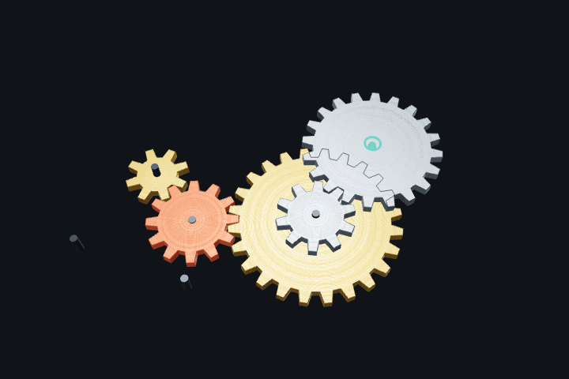

# Gear Puzzles

Gear-train puzzles in the browser: take gears from the tray and put them on the pins so the output
axle turns at the target speed and direction.

**[Play it in the browser](https://mykola-nikoliuk.github.io/gear-puzzles/)**



## What's inside

- **Exact simulation.** Rotation spreads through the meshed gears as exact fractions, so a
  12 → 24 → 10 → 20 train gives exactly 1/16 turn/s, with no float drift. Two paths that ask one
  axle for different speeds jam the train.
- **Two layers per axle.** Any gear fits on any layer. Two gears on one axle form a compound gear
  and carry the rotation up to the other layer. The motor's short pin shows at a glance that it
  takes no more gears.
- **Real-world tolerances.** Gears mesh when their pitch circles touch, with a little backlash
  allowed. A gear refuses to go where its teeth would clash with a neighbour or where it would
  spin through another pin.
- **Direct manipulation.** You drag gears over the pins, and a dropped gear lands on the best
  free layer. Dropping on a taken axle swaps the two gears. If a spot is refused, the HUD says
  why.
- **Solver.** A breadth-first search over layouts finds the shortest solution and replays it on
  the board.
- **Level generator.** Seeded and reproducible. It builds a working train from the motor first,
  so every level is solvable by construction. Then it adds spare axles and decoy gears and takes
  the train apart into the tray.
- **Developer panel** ([lil-gui](https://lil-gui.georgealways.com/)). It controls the motor
  speed and direction, gear thickness, axle labels and camera tilt. It also has Reset and Solve,
  plus the generator settings.

Planned: levels written by an LLM, each checked by the solver before it is accepted.

## Recording the GIF

With `yarn dev` running and a level turning, call `captureLoop()` in the browser console. It
renders exactly one period of the train, so the GIF loops without a seam. The period is the
shortest time in which every gear advances a whole number of teeth.

## Stack

TypeScript, Three.js, Vite, Vitest.

## Scripts

```sh
yarn dev    # start the dev server
yarn lint   # type-check, ESLint and Prettier
yarn test   # unit tests
yarn build  # production build
```
